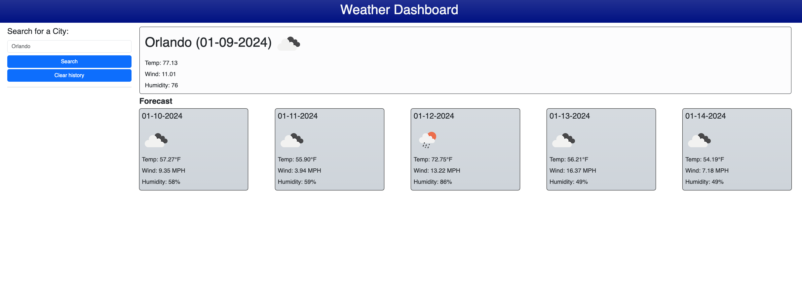
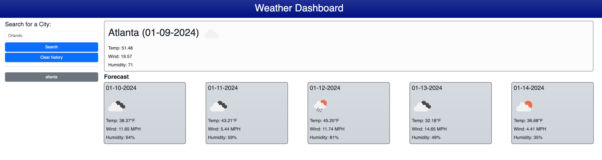
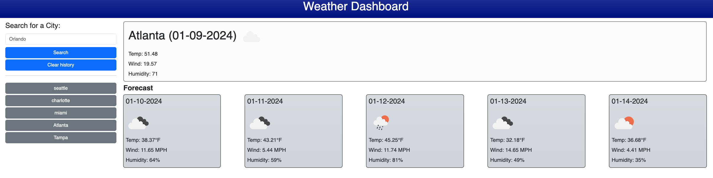

# Weather Dashboard

## Description
    I made a page that will display the current weather and the next 5 days weather forecast for a city. This a big learning curve to understand 3rd party APIs. I learned how to use async/await and use javascript to write to the HTML file. 

## Installations
    No installation necessary, use the following URL to get to the site. https://mikenguyen1092.github.io/06_Weather-Dashboard/

## Usage
    1. Click the link open the page, and you are presented with the forecast of Orlando, FL. 
 

    2. Type in a city of your choice and click submit to get that city's forecast.

    3. You can also click on one of the previous searches and it will give the results.

## Credits
    Michael Nguyen

    EdX AI chat

### Help Video
    https://www.youtube.com/watch?v=vn3tm0quoqE&t=593s 
    
## License
    MIT License

    Copyright (c) [2024] [Michael Nguyen]

    Permission is hereby granted, free of charge, to any person obtaining a copy of this software and associated documentation files (the "Software"), to deal in the Software without restriction, including without limitation the rights to use, copy, modify, merge, publish, distribute, sublicense, and/or sell copies of the Software, and to permit persons to whom the Software is furnished to do so, subject to the following conditions:

    The above copyright notice and this permission notice shall be included in all  copies or substantial portions of the Software.

    THE SOFTWARE IS PROVIDED "AS IS", WITHOUT WARRANTY OF ANY KIND, EXPRESS OR IMPLIED, INCLUDING BUT NOT LIMITED TO THE WARRANTIES OF MERCHANTABILITY, FITNESS FOR A PARTICULAR PURPOSE AND NONINFRINGEMENT. IN NO EVENT SHALL THE AUTHORS OR COPYRIGHT HOLDERS BE LIABLE FOR ANY CLAIM, DAMAGES OR OTHER LIABILITY, WHETHER IN AN ACTION OF CONTRACT, TORT OR OTHERWISE, ARISING FROM, OUT OF OR IN CONNECTION WITH THE SOFTWARE OR THE USE OR OTHER DEALINGS IN THE SOFTWARE.